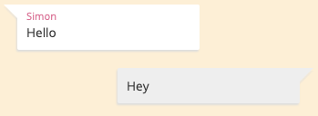
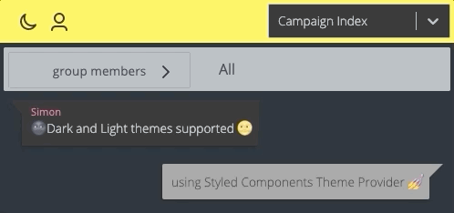
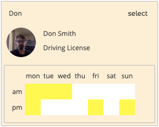

# GA PROJECT 4: VOLUNTEER HUB
### BRIEF

In a team of 2, create a full stack app using React, Django and PostgreSQL with a design and functionality of our own choosing.

In collaboration with [Don Graham](github.com/dongra02)

### TIMEFRAME

7 days

### TECHNOLOGIES

* React
* JavaScript (ES6)
* Python
* PostgreSQL
* Django (with channels)
* HTML
* CSS
* Sass

### OUTLINE

Our idea for an app was tool which would allow people to organise volunteers on charitable projects. We had both recently experienced community led projects (COVID mutual aid and the response to the Beirut explosion) which were composed of overlapping groups and organised using basic tools like Google forms. We felt that we could create something that allowed for simple management of volunteers through their schedule availability and skill sets. A user could also use this data to find projects in their vicinity that suited their skills.

###  PLANNING

With the experience of our last project in mind we started planning for this by creating an Entity Relationship Diagram. During our previous project the database models had to be updated multiple times as we had not fully considered the relationships; this time with the diagram we could easily see the necessary connections due to having a visual representation. We also had a good idea of which resources would own the data in the one-to-many fields.


We followed up with a few wireframes for the main page components. These were mostly simple and ended up being a good representation of the final product, apart from the campaign view page which evolved a lot over time as we continued to add features later in the process.

We decided that we would split the responsibilities for the front and back end with myself taking the front end work as this played to both of our strengths and interests.

### CHAT FEATURE USING WEBSOCKETS

The big unknown element of the project was the use of WebSockets to enable a live chat feature. We felt that the functioning of the app was completely dependent on this as it was all about communication between groups.

We started work on this by reading the docs and finding as much information as we could about the implementation. Because most of the material available was based around the templated HTML style of Django we had some issues implementing it correctly. This was mostly due to our lack of experience with Django and its general structure and after some unsuccessful attempts we decided to start over completely. 
We had an almost immediate success at this point because the failed attempt gave us a good amount of practice with the framework and allowed us to understand the process more clearly the second time around.

Once we had the backend set up and the front end communicating with it we planned out how the data would be stored. We drew a second set of diagrams showing how the messages would be stored in relation to the rooms, and how the rooms would relate to the projects and users too.  We decided that all projects would be initialised with two default chat rooms - one for coordinators and one for all volunteers.

#### CHAT DISPLAY

I wanted to use the Styled Components library in this project as the idea of including styling in components to make them modular was really appealing to me from a design point of view. The first component that I used it with was the chat message boxes - I wanted a simple layout of having a box with rounded corners, shadows and a small triangle attached to make it look like a speech bubble. Creating this in CSS was a bit trickier than I imagined, as the triangle (with clip-path) would not allow for a box-shadow. I got around this by making another triangle that was blurred and sat underneath to look like a shadow. In the image below you can see the final result, with a different style for the users own messages on the right.



Next up was tackling the formatting of links in the chat. I intended to use RegEx to determine any links and then wrap them in an <a> tag. Finding the right RegEx was very quick after a short search, but transforming the string was not working as it should, with the formatted text displaying the tags rather than rendering them as HTML. I solved this by splitting the links out of the text and reinserting them as new anchor elements.

In the code below, the message content is first split where new lines occur and then each section is inserted as a paragraph in order to preserve the formatting.

```javascript
{data.text.split('\n').map((line, i) => {
	// Find all links and separate from plain text, return as an array
  const interpolated = this.interpolateLinks(line)
	// If array item is a link, return an anchor, otherwise return plain text
  return <Text key={i}>{interpolated.map(frag => (
    frag.match(linkMatch) ? <Link href={this.getHref(frag)} target="_blank">{frag}</Link> : frag
   ))}</Text>
})}
```

I then wrote some code to scroll the window to any new messages and created the input component by building a custom text area and attaching a small toolbar along the bottom. The toolbar included a send button and later on an emoji button too. I wrote a small helper function for the chat input so that shift + enter would result in a new line and enter on its own would send the message.


### CREATING A STYLE WITH THEMES

During the work on the chat component I had also been working on some styled inputs to be used across the app. As I was working on these things I had worked out a colour theme (yellow and light pink) and also picked out some alternatives for a dark mode.  This was a really fun feature to add in as I always enjoy its inclusion on websites that I use. The implementation using Styled Components was very straightforward too - I simply defined the variables for each theme in the root component (primary colour, background, accents, etc.) and then passed the information down to all child components using the Theme Provider.




### MAP FOR PROJECT DISCOVERY

The index page is a map with search inputs and list display that shows all projects that are visible on the map, along with markers for each one.
Experience gained using Mapbox on a previous project really paid off here as I was able to set it up in a fraction of the time and with much cleaner code. I built a custom marker and linked the search inputs to filter the data coming in from the back end. This also filters by the bounds of the map using a couple of checks against the LatLng data for each project.

```javascript
const filteredResults = campaigns
	// Filter by visible area of map
  .filter(result => {
    const inLat = result.latitude > bounds._sw.lat && result.latitude < bounds._ne.lat
    const inLng = result.longitude > bounds._sw.lng && result.longitude < bounds._ne.lng
    return inLat && inLng
  })
  // Attach data for customising associated map marker
  .map((result, i) => ({ ...result, color: '#222', size: 20, number: ++i }))
```

I then built a list display for the results that contains a card for each one. These cards are expandable upon clicking; the idea is to only display a single card if it is expanded.  The combination of React and Styled Components made the functionality for this quite clean. Upon clicking a card, its ID would be sent back to the parent which would move the selected card into the right position. This makes the transition (simply using the CSS property) really smooth as the effects of all the cards are synchronised due to the parent components control over them.

```javascript
// Return a card for each result in the list
campaigns.map((campaign, i) => {
	const expanded = campaign.id === resultShowingDetail
  return (
    <ResultsItem
      key={i}
      position={i}
      {...campaign}
		// Toggles details view
      expanded={expanded}
		// Hides the card if another card is visible
      visible={expanded || resultShowingDetail === -1}
      showDetails={this.showDetail}
      signUp={signUp}
    />
}
```

I used this setup later on in the volunteer management feature which turned out really well. It consisted of two of these components that would behave in the same way as the cards, where expanding one list would hide the other.

### VOLUNTEER MANAGEMENT

Functionality for managing the volunteers was really important to us, as the app would be a more general purpose chat app without it. I  wanted a way for organisers to understand at a glance who was available at any given time as well as be able to find people with specific skills to suit a task.

The first element that I built was the user settings that could be accessed on a users profile page and would allow them to set their availability and declare their skills. I made the scheduling component (as seen in the card below) and linked it to the back end using a put request to edit the profile data; we simplified the timetable to have 14 slots (am and pm each day) and stored the data as a list of numerical ID’s.

Having set the data on the users, I then pulled the data for all volunteers on a project into the coordinator view; this allowed me to display all of a users relevant data in a card format.



As you can see in the image there is a select button on the cards. This allows the coordinator to select any number of users and then create a new chat room with them. This allowed for all of the desired functionality but I wanted to allow coordinators to find the relevant users in a simple manner.

Using the same components that were designed for setting the schedule and skills on the profile page, I allowed the coordinators to select any number of time slots and skills in order to filter the user list. This also included functionality to filter using strict rules or not; this could be useful in the situation that they would want to find all volunteers available on the weekend without them each needing to be available on both days.


Another element was added to the project view at this point for a community noticeboard. This is intended to display more important messages that would not be suited to chat due to new messages burying the information. The coordinator view of the page differed here only in showing the input for sending and deleting messages where the regular volunteer view would be read only.

### CONCLUSION AND KEY LEARNINGS

I was really pleased with the way that this project turned out and was particularly proud of the UI design that I implemented. In comparison with previous projects this one has a much more dynamic feel to it and a more consistent design. This was largely due to the use of Styled Components with React - I think that the ability to create fully modular components using this library really allowed me to embrace Reacts philosophy of separating concerns.

Working in a team was a great success too. Our decision to split our responsibilities according to our strengths really paid off in terms of development speed. However, one are that this highlighted  as needing work is my ability to document my code thoroughly. Because I was working solo on the front end for the first 3 or 4 days I often didn’t stop to think about this and this ended up costing time later on when Don moved over to helping on the front end and I had to explain my work over a call. 

The modular approach to design as I mentioned above did make the team work a lot easier too. Once I had made some of the components like the inputs and scheduler, Don was able to drop them into whatever he was working on without having to worry about consistency in the design and the theme system was obviously a huge boon here too.

It did also open my eyes to the difficulty of designing reusable components and it will be something that I will continue to focus on in the future.

### FUTURE IMPROVEMENTS

We were quite ambitious with the scope of this project so there are quite a few features that we would have liked to include but did not have the time, with the main ones being: searchable tags for projects, direct messages, emoji shortcuts a la Slack, project timetables with assigned shifts and a photo gallery. However, we both enjoyed the project a lot and are excited to continue work on it, so these features will be added over time.